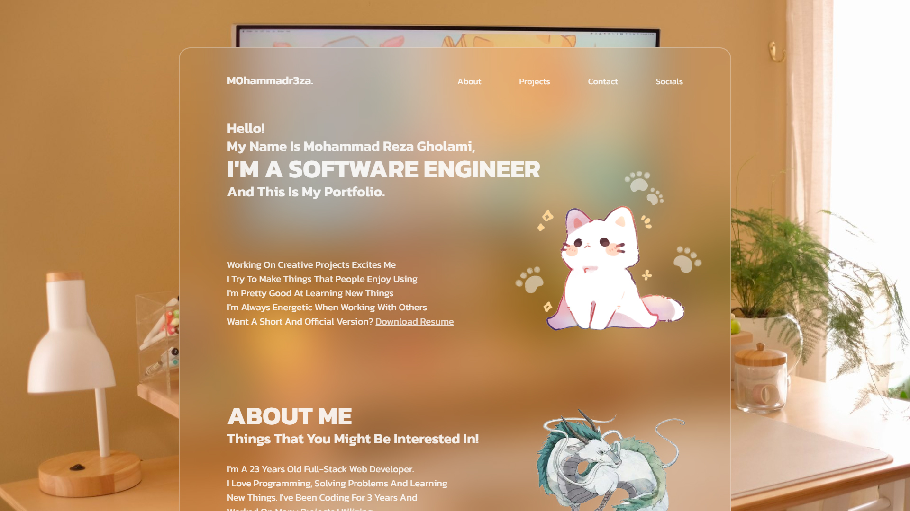
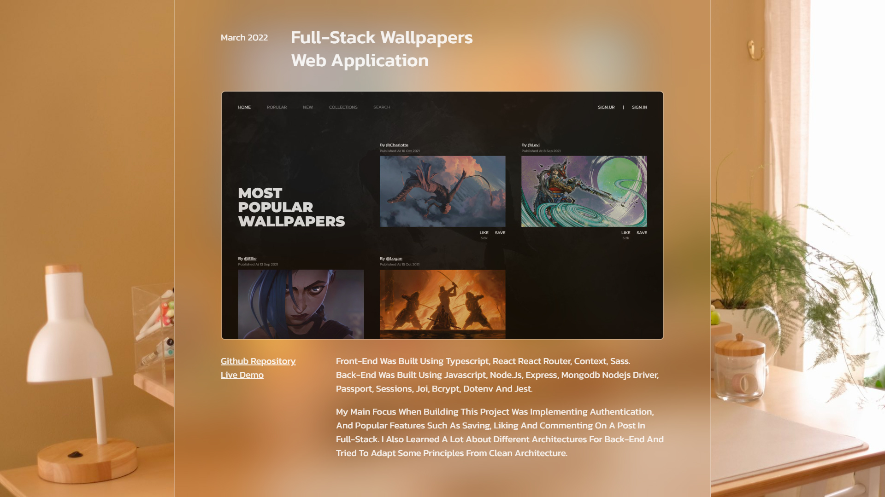
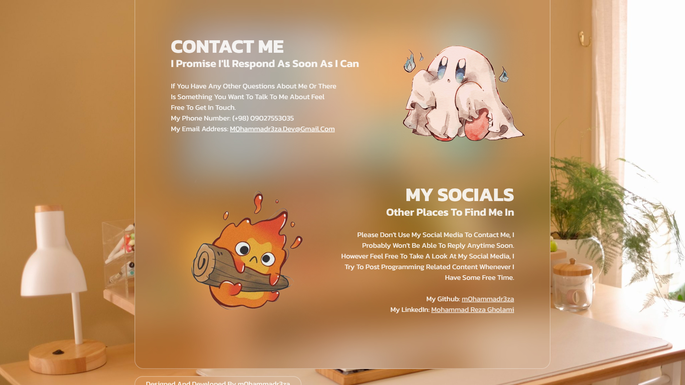

# Portfolio V1.0

[Live Demo](https://m0hammadr3za.vercel.app) • This is my single page, next.js, portfolio web application. Here you can read about my experience, my skills, and some other information about me, as a software engineer, you might be interested in. You can also check out my single page, pdf, [Resume](https://m0hammadr3za.vercel.app/resume.pdf).

## Technologies

- Javascript
- Next.js
- Sass

## Installation

1. Clone repository
2. Install dependencies: `npm install`
3. Start development: `npm run dev`

## Development Commands

- `npm run dev`: Start development server
- `npm run build`: Create production build
- `npm start`: Launch production server

Access via:

http://localhost:3000

## Screenshots

